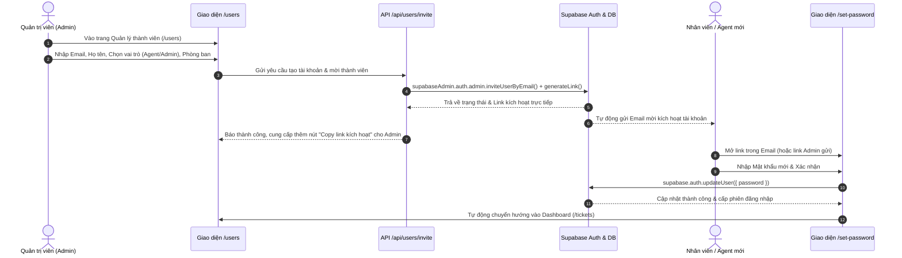

# Kế Hoạch Chuyển Đổi: Bỏ Đăng Ký Tự Do & Triển Khai Admin Tạo/Mời Tài Khoản Cho Agent Qua Email

Tài liệu này chi tiết hóa phương án loại bỏ trang đăng ký tự do, chuyển toàn bộ quyền cấp tài khoản về Quản trị viên (Admin). Admin sẽ tạo tài khoản cho Agent hoặc Admin mới, hệ thống sẽ gửi email xác thực/kích hoạt để người dùng tự thiết lập mật khẩu.

---

## 1. Mục tiêu & Luồng hoạt động mới (Workflow)

---

## 2. Chi tiết các thay đổi cấu trúc

### A. Loại bỏ Đăng ký tự do
1. **Xóa bỏ trang Đăng ký**:
   - Xóa `app/(auth)/register/page.tsx`.
2. **Cập nhật trang Đăng nhập (`app/(auth)/login/page.tsx`)**:
   - Xóa liên kết *"Chưa có tài khoản? Đăng ký ngay"*.
   - Thay bằng dòng hướng dẫn: *"Tài khoản hệ thống do Quản trị viên cấp. Vui lòng liên hệ Admin nếu bạn chưa có tài khoản."*
3. **Cập nhật Middleware (`lib/supabase/middleware.ts`)**:
   - Bỏ `/register` khỏi danh sách `isAuthPage`.
   - Bổ sung trang kích hoạt `/set-password` vào ngoại lệ không bị chặn redirect.
   - Thêm bảo vệ route `/users` (chỉ user đã đăng nhập mới truy cập được, và kiểm tra quyền admin).

---

### B. Xây dựng Tính Năng Quản Lý Người Dùng & Mời Thành Viên (Dành riêng cho Admin)

1. **Menu điều hướng `Navbar.tsx`**:
   - Khi `user?.role === 'admin'`: Thêm nút điều hướng **"Thành viên"** (`/users`) với icon `Users` cạnh menu "Quản lý Nhãn".

2. **Trang Giao diện Quản lý Thành viên (`app/(dashboard)/users/page.tsx`)**:
   - Hiển thị danh sách tất cả tài khoản với bảng trực quan:
     - Avatar chữ cái + Họ tên + Email
     - Huy hiệu Vai trò (`admin` - Đỏ tím, `agent` - Xanh biển lam, `user` - Xám)
     - Phòng ban
     - Ngày tạo
   - Nút **"Thêm thành viên mới"** mở Popup/Modal:
     - Form: Email công việc (*bắt buộc*), Họ và tên (*bắt buộc*), Vai trò (*Agent hỗ trợ* hoặc *Quản trị viên*), Phòng ban.
     - Nút xác nhận: "Gửi lời mời kích hoạt".
   - Sau khi gửi thành công:
     - Hiển thị thông báo xác nhận đã gửi email.
     - Cung cấp sẵn **Đường link kích hoạt dự phòng (Direct Invite Link)** để Admin có thể copy gửi trực tiếp qua Zalo/Teams nếu email công ty lọc spam hoặc đến chậm.

3. **API Endpoint Mời Thành Viên (`app/api/users/invite/route.ts`)**:
   - Xác thực: Kiểm tra người gọi API có phiên đăng nhập và vai trò là `admin`.
   - Sử dụng `createAdminClient()` (service_role key):
     - Kiểm tra email đã có trong hệ thống chưa.
     - Gọi `supabaseAdmin.auth.admin.inviteUserByEmail(email, { data: { full_name, role, department }, redirectTo: ... })`.
     - Đồng thời sinh link `generateLink({ type: 'invite', ... })` để gửi về cho giao diện Admin.
     - Trigger cơ sở dữ liệu `handle_new_user` đã viết sẵn trong Supabase sẽ tự động chèn thông tin họ tên, email, vai trò vào bảng `public.users`.

4. **API Endpoint Lấy danh sách thành viên (`app/api/users/route.ts`)**:
   - Bổ sung trường `created_at` để hiển thị ngày tham gia của thành viên.

---

### C. Giao diện Kích Hoạt Tài Khoản & Thiết Lập Mật Khẩu (`app/(auth)/set-password/page.tsx`)
- Trang tiếp nhận người dùng khi họ nhấn vào liên kết trong email mời hoặc link do Admin gửi:
  - Form: Nhập **Mật khẩu mới** và **Xác nhận mật khẩu** (tối thiểu 6 ký tự).
  - Tự động nhận diện phiên xác thực của Supabase.
  - Gọi `supabase.auth.updateUser({ password: newPassword })`.
  - Sau khi thiết lập mật khẩu thành công:
    - Hiển thị thông báo "Tài khoản của bạn đã được kích hoạt thành công!".
    - Tự động chuyển hướng vào `/tickets` để bắt đầu làm việc.

---

## 3. Kế hoạch Kiểm Thử (Verification Plan)
1. **Kiểm tra loại bỏ trang đăng ký**:
   - Truy cập `/register` xem có bị loại bỏ / trả về 404 hoặc chuyển về `/login`.
   - Mở `/login` kiểm tra không còn link đăng ký tự do.
2. **Kiểm tra luồng Admin mời thành viên**:
   - Đăng nhập với tài khoản Admin.
   - Kiểm tra menu "Thành viên" xuất hiện trên Navbar.
   - Nhấn vào `/users`, điền form mời một Agent mới (vd: `agent_test@example.com`).
   - Kiểm tra API trả về thành công kèm link kích hoạt.
3. **Kiểm tra kích hoạt tài khoản**:
   - Mở link kích hoạt đến trang `/set-password`.
   - Nhập mật khẩu mới -> Kích hoạt -> Đăng nhập thành công với vai trò Agent.
4. **Kiểm tra build**:
   - Chạy `npm run build` đảm bảo không có lỗi type hoặc cấu trúc trang.
